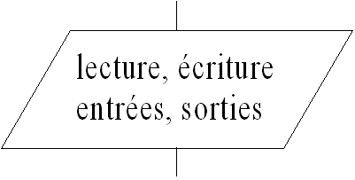
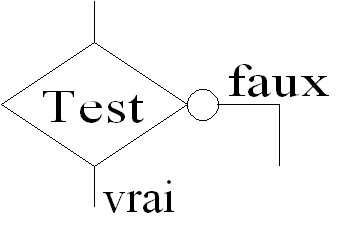
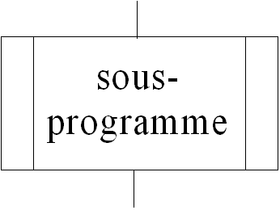

Introduction à l'algorithmique
==============================

### Algorigrammes

 

2014-07

 

**[NETCAT](http://www.netcat.io) / [@netcat](http://twitter.com/netcat)**

---

Vue d'ensemble
--------------

----

### Définition 

* **Algorigramme** ou **organigramme de programmation** : 
  représentation graphique normalisée de   
  l'enchaînement des opérations et des
  décisions effectuées par un programme
  d'ordinateur.

----

Structure général d'un programme
--------------------------------

- Déclarations (variables, constantes)
- Initialisation (variables, contantes)
- Programme principal (calculs)
- Gestion des erreurs
- Sortie (affichage des résultats et fin)

---

Instructions
------------

----

### Entrée - sorties

Ex: 

[Destination] &larr; (Source)

[Source] &rarr; (Destination)

---

### Variables

* Représentation en mémoire
* Nom de variables
* Déclaration et assignation
* Déclarations multiples
* Assignations multiples

----

### Tests conditionnels

On note que les flèches vont "vers l'avant".

----

### Boucles

Comme les test, mais l'une des flèches revient vers une instruction déja executée.

----

### Sous-programmes

---

Simulation d'éxecution
----------------------

- Lister les données de départ
- Suivre les instructions une à une
- Remplacer par la nouvelle valeur quand une instruction modifie une variable
- Continuer...
- Jusqu'à la fin du programme

---

Questions
---------

---

[Suite: Instructions et variables](03-variables.md)

